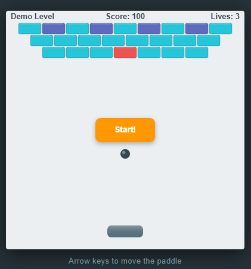

# simplenoid



A simple Arkanoid/Breakout clone built with vanilla ES6 and HTML5 Canvas — no external dependencies.

## How to play

Open `index.html` in any modern browser.

- Use the **left / right arrow keys** to move the paddle.
- Break all the bricks to complete each level.
- You lose a life when the ball falls below the paddle.

## Brick types

| Type | Description |
|------|-------------|
| Basic | One hit to destroy. |
| Double | Turns into a Basic brick when first destroyed; requires a second hit to clear completely. |
| Solid | Requires two hits to destroy. |
| Unbreakable | Cannot be destroyed. |

## Project structure

```
index.html          Entry point
css/
  arkanoid.css      Styles
js/
  game.js           Main game logic (constants, game loop, collision detection)
  rx.js             Reactive utilities
  util.js           General utilities
  watches.js        Observable watch helpers
  arkanoid/
    arkanoid.js     Legacy game configuration (levels, brick catalogue)
    ball.js         Ball entity
    bat.js          Paddle entity
    brick.js        Brick entity
    livescounter.js Lives display
    scorecounter.js Score display
    screen.js       Level/screen management
```

## License

MIT — see [LICENSE](LICENSE).

